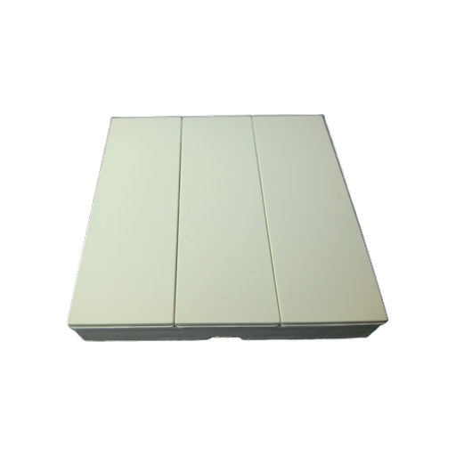
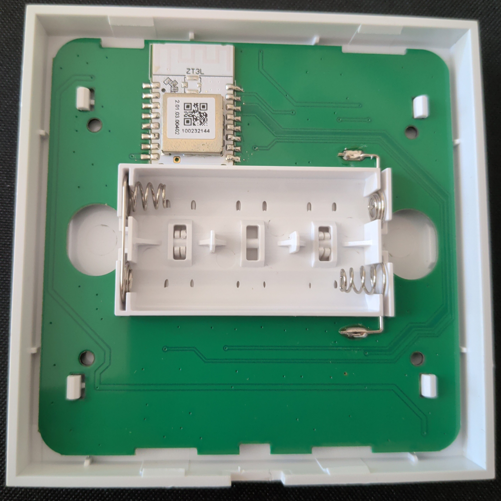
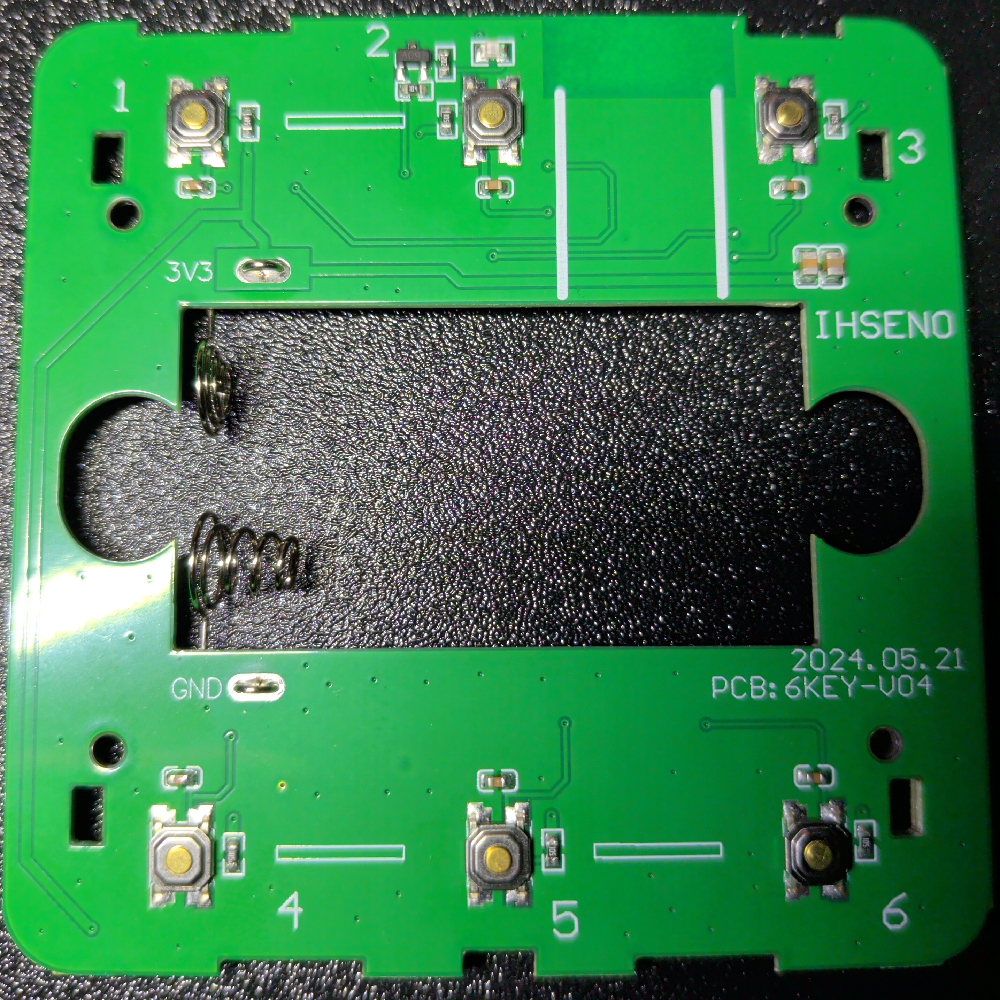

# TS0046 _TZ3000_nrfkrgf4 Tuya

Slacky model: **TS0046-M008-SlD** (`DEVICE_MODEL_8` / `_model_8`)

- Original: [TS0046](https://www.zigbee2mqtt.io/devices/TS0046.html)
- Manufacturer: `_TZ3000_nrfkrgf4`
- Buttons: 6

Build: `make PROJECT_MODEL=_model_8` (see `win_make.cmd`). Firmware version: **v1.0.06**.

